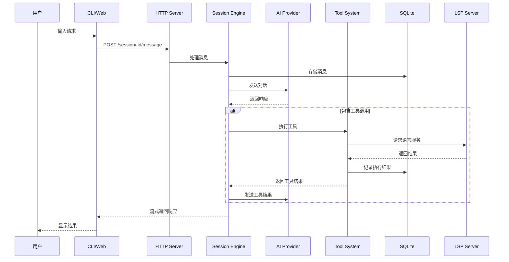
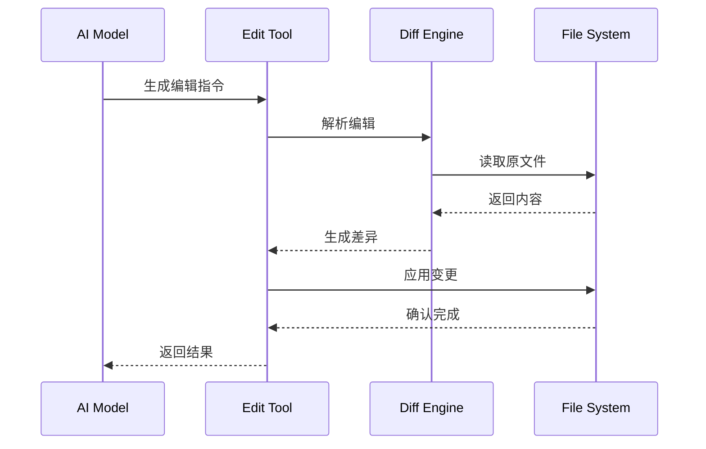
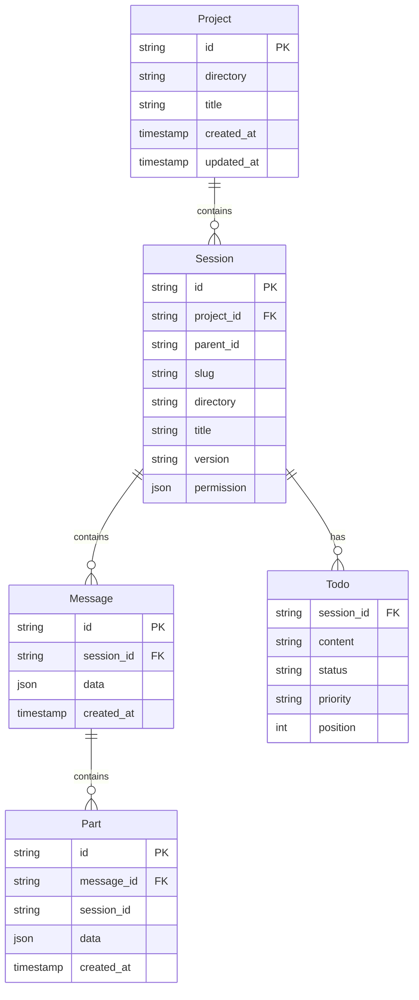

# OpenCode 架构设计

## 系统概览

OpenCode 采用客户端/服务器架构设计，核心是一个 AI 驱动的代码助手，通过工具系统与文件系统、终端等交互。

### 架构分层

```
┌─────────────────────────────────────────────────────────────┐
│                      Client Layer                           │
│  ┌─────────┐  ┌─────────┐  ┌─────────┐  ┌─────────────────┐  │
│  │   CLI   │  │   Web   │  │ Desktop│  │     SDK        │  │
│  └────┬────┘  └────┬────┘  └────┬────┘  └───────┬─────────┘  │
└───────┼────────────┼────────────┼──────────────┼───────────┘
        │            │            │              │
        └────────────┴────────────┴──────────────┘
                              │
                              ▼
┌─────────────────────────────────────────────────────────────┐
│                     Server Layer                            │
│  ┌──────────────────────────────────────────────────────┐  │
│  │                    Hono HTTP Server                   │  │
│  │  ┌─────────┐ ┌─────────┐ ┌─────────┐ ┌─────────────┐ │  │
│  │  │ Session │ │  File   │ │ Config  │ │   PTY       │ │  │
│  │  │ Routes  │ │ Routes  │ │ Routes  │ │   Routes    │ │  │
│  │  └─────────┘ └─────────┘ └─────────┘ └─────────────┘ │  │
│  └──────────────────────────────────────────────────────┘  │
└───────────────────────────────┬─────────────────────────────┘
                                │
        ┌───────────────────────┼───────────────────────┐
        ▼                       ▼                       ▼
┌───────────────┐     ┌─────────────────┐     ┌─────────────────┐
│   Database    │     │   AI Provider   │     │   LSP Server    │
│   (SQLite)    │     │   (External)    │     │   (External)    │
└───────────────┘     └─────────────────┘     └─────────────────┘
```

## 核心组件

### 1. 会话引擎 (Session Engine)

负责管理 AI 对话的生命周期。

```
┌─────────────────────────────────────────────────────────────┐
│                    Session Engine                           │
│                                                             │
│  ┌──────────┐    ┌──────────────┐    ┌──────────────────┐  │
│  │  User    │───▶│   Message    │───▶│  LLM Processor   │  │
│  │  Input   │    │   Queue      │    │                  │  │
│  └──────────┘    └──────────────┘    └────────┬─────────┘  │
│                                                │            │
│        ┌───────────────────────────────────────┘            │
│        ▼                                                        │
│  ┌──────────────┐    ┌──────────────┐    ┌────────────────┐  │
│  │    Tool      │◀───│   Tool       │───▶│    File       │  │
│  │   Executor   │    │  Registry    │    │   System      │  │
│  └──────────────┘    └──────────────┘    └────────────────┘  │
│                                                             │
│  ┌──────────────────────────────────────────────────────┐   │
│  │                   SQLite Database                     │   │
│  │  ┌────────┐ ┌────────┐ ┌────────┐ ┌────────────────┐ │   │
│  │  │Session │ │Message │ │  Part  │ │     Todo      │ │   │
│  │  │ Table  │ │ Table  │ │ Table  │ │    Table      │ │   │
│  │  └────────┘ └────────┘ └────────┘ └────────────────┘ │   │
│  └──────────────────────────────────────────────────────┘   │
└─────────────────────────────────────────────────────────────┘
```

**处理流程：**

1. 用户输入进入消息队列
2. 消息经过处理后发送到 LLM
3. LLM 返回可能包含工具调用
4. 工具注册表查找对应工具
5. 工具执行器执行工具
6. 执行结果返回给 LLM
7. 最终响应返回给用户

### 2. 工具系统 (Tool System)

OpenCode 的核心创新，允许 AI 执行实际操作。

```
┌─────────────────────────────────────────────────────────────┐
│                     Tool System                            │
│                                                             │
│  ┌─────────────────────────────────────────────────────┐   │
│  │                  Tool Registry                       │   │
│  │  ┌──────────────────────────────────────────────┐   │   │
│  │  │  Built-in Tools      │   Custom Tools        │   │   │
│  │  ├──────────────────────┼───────────────────────┤   │   │
│  │  │ • bash               │ • Plugin Tools        │   │   │
│  │  │ • read               │ • User-defined Tools  │   │   │
│  │  │ • write              │ • MCP Tools           │   │   │
│  │  │ • edit               │                       │   │   │
│  │  │ • glob               │                       │   │   │
│  │  │ • grep               │                       │   │   │
│  │  │ • lsp                │                       │   │   │
│  │  │ • webfetch           │                       │   │   │
│  │  └──────────────────────┴───────────────────────┘   │   │
│  └─────────────────────────────────────────────────────┘   │
│                                                             │
│  ┌─────────────────────────────────────────────────────┐   │
│  │                  Tool Executor                        │   │
│  │                                                       │   │
│  │  ┌─────────┐  ┌─────────┐  ┌─────────────────────┐  │   │
│  │  │ Permission│─▶│ Validator│─▶│   Implementation  │  │   │
│  │  │  Check   │  │          │  │                    │  │   │
│  │  └─────────┘  └─────────┘  └─────────────────────┘  │   │
│  └─────────────────────────────────────────────────────┘   │
└─────────────────────────────────────────────────────────────┘
```

### 3. 提供商系统 (Provider System)

统一接口对接多种 AI 模型。

```
┌─────────────────────────────────────────────────────────────┐
│                    Provider System                         │
│                                                             │
│  ┌─────────────────────────────────────────────────────┐   │
│  │                 Provider Manager                      │   │
│  │                                                       │   │
│  │  ┌─────────────────────────────────────────────┐    │   │
│  │  │           AI SDK (Vercel)                    │    │   │
│  │  └─────────────────────────────────────────────┘    │   │
│  │                      │                               │   │
│  │         ┌────────────┼────────────┐                 │   │
│  │         ▼            ▼            ▼                  │   │
│  │  ┌──────────┐ ┌──────────┐ ┌──────────┐           │   │
│  │  │  OpenAI   │ │Anthropic │ │  Google  │           │   │
│  │  │  Provider │ │ Provider │ │ Provider │           │   │
│  │  └──────────┘ └──────────┘ └──────────┘           │   │
│  │         │            │            │                 │   │
│  │         ▼            ▼            ▼                  │   │
│  │  ┌─────────────────────────────────────────────┐    │   │
│  │  │              External APIs                   │    │   │
│  │  └─────────────────────────────────────────────┘    │   │
│  └─────────────────────────────────────────────────────┘   │
└─────────────────────────────────────────────────────────────┘
```

### 4. LSP 集成

语言服务器协议集成，提供代码智能功能。

```
┌─────────────────────────────────────────────────────────────┐
│                    LSP Integration                         │
│                                                             │
│  ┌─────────────────────────────────────────────────────┐   │
│  │                   LSP Client                         │   │
│  │                                                       │   │
│  │  ┌─────────────────────────────────────────────────┐ │   │
│  │  │              JSON-RPC Protocol                   │ │   │
│  │  └─────────────────────────────────────────────────┘ │   │
│  └─────────────────────────┬───────────────────────────┘   │
│                            │                                 │
│         ┌──────────────────┼──────────────────┐             │
│         ▼                  ▼                  ▼              │
│  ┌────────────┐    ┌────────────┐    ┌────────────┐       │
│  │   TypeScript│    │    Deno    │    │   Rust     │       │
│  │   Server    │    │   Server   │    │  Analyzer  │       │
│  └────────────┘    └────────────┘    └────────────┘       │
│                                                             │
│  ┌─────────────────────────────────────────────────────┐   │
│  │              Supported Features                      │   │
│  │  • Code Completion    • Go to Definition            │   │
│  │  • Find References    • Rename Symbol              │   │
│  │  • Hover Information   • Diagnostics               │   │
│  │  • Code Formatting     • Folding Ranges             │   │
│  └─────────────────────────────────────────────────────┘   │
└─────────────────────────────────────────────────────────────┘
```

## 数据流

### 主请求流程



### 文件编辑流程



## 模块依赖

### 核心依赖关系

```
packages/opencode/
├── index.ts              # 入口
│
├── cli/                  # CLI 层
│   └── cmd/              # 命令实现
│
├── server/               # 服务器层
│   ├── server.ts         # 主服务器
│   ├── routes/          # API 路由
│   └── event.ts         # 事件处理
│
├── session/              # 核心业务层
│   ├── session.sql.ts   # 数据模型
│   ├── processor.ts     # 消息处理
│   ├── llm.ts          # LLM 调用
│   └── message.ts      # 消息处理
│
├── tool/                 # 工具层
│   ├── registry.ts      # 工具注册
│   └── *.ts             # 各工具实现
│
├── provider/             # 提供商层
│   ├── provider.ts      # 提供商管理
│   └── models.ts        # 模型配置
│
├── lsp/                  # LSP 层
│   ├── server.ts        # LSP 服务器
│   └── client.ts        # LSP 客户端
│
├── config/               # 配置层
│   └── config.ts        # 配置管理
│
└── util/                 # 工具层
    ├── log.ts           # 日志
    ├── filesystem.ts    # 文件操作
    └── ...
```

## 存储架构

### SQLite 数据库表



## 部署架构

### 单机部署

```
┌─────────────────────────────────────────────┐
│               User's Machine                │
│                                             │
│  ┌─────────────────────────────────────┐   │
│  │           OpenCode CLI               │   │
│  │  ┌─────────┐    ┌─────────────────┐ │   │
│  │  │  TUI    │    │   HTTP Server   │ │   │
│  │  │(终端界面) │    │  (localhost)    │ │   │
│  │  └────┬────┘    └────────┬────────┘ │   │
│  │       │                  │           │   │
│  │       └────────┬─────────┘           │   │
│  │                ▼                      │   │
│  │         ┌────────────┐                │   │
│  │         │  SQLite DB │                │   │
│  │         └────────────┘                │   │
│  └─────────────────────────────────────┘   │
│                    │                        │
└────────────────────┼────────────────────────┘
                     │
                     ▼
              ┌────────────┐
              │  AI Provider│
              │(OpenAI等)   │
              └────────────┘
```

### 服务器部署

```
┌─────────────────────────────────────────────────────────────┐
│                    Server Deployment                        │
│                                                             │
│  ┌──────────────┐    ┌──────────────┐    ┌─────────────┐  │
│  │  Web Client  │    │  Desktop App │    │   CLI       │  │
│  └──────┬───────┘    └──────┬───────┘    └──────┬──────┘  │
│         │                    │                    │          │
│         └────────────────────┼────────────────────┘          │
│                              │                               │
│                              ▼                               │
│  ┌───────────────────────────────────────────────────────┐  │
│  │                 Load Balancer                          │  │
│  └─────────────────────────┬─────────────────────────────┘  │
│                            │                                 │
│         ┌──────────────────┼──────────────────┐             │
│         ▼                  ▼                  ▼              │
│  ┌────────────┐    ┌────────────┐    ┌────────────┐        │
│  │  Server 1  │    │  Server 2  │    │  Server N  │        │
│  │ ┌────────┐ │    │ ┌────────┐ │    │ ┌────────┐ │        │
│  │ │  Hono  │ │    │ │  Hono  │ │    │ │  Hono  │ │        │
│  │ │ Server │ │    │ │ Server │ │    │ │ Server │ │        │
│  │ └────────┘ │    │ └────────┘ │    │ └────────┘ │        │
│  └──────┬─────┘    └──────┬─────┘    └──────┬─────┘        │
│         │                │                  │              │
│         └────────────────┼──────────────────┘              │
│                          ▼                                   │
│  ┌───────────────────────────────────────────────────────┐  │
│  │              Shared Storage                            │  │
│  │  ┌────────────┐  ┌────────────┐  ┌───────────────┐  │  │
│  │  │  Database  │  │   Cache    │  │  File Storage │  │  │
│  │  │  (Remote)  │  │  (Redis)   │  │    (S3/Local) │  │  │
│  │  └────────────┘  └────────────┘  └───────────────┘  │  │
│  └───────────────────────────────────────────────────────┘  │
│                            │                                 │
│                            ▼                                 │
│              ┌────────────────────────────┐                  │
│              │       AI Provider          │                  │
│              │(OpenAI/Anthropic/Google)   │                  │
│              └────────────────────────────┘                  │
└─────────────────────────────────────────────────────────────┘
```
