# OpenCode 架构图表

## 系统架构图

### 整体架构

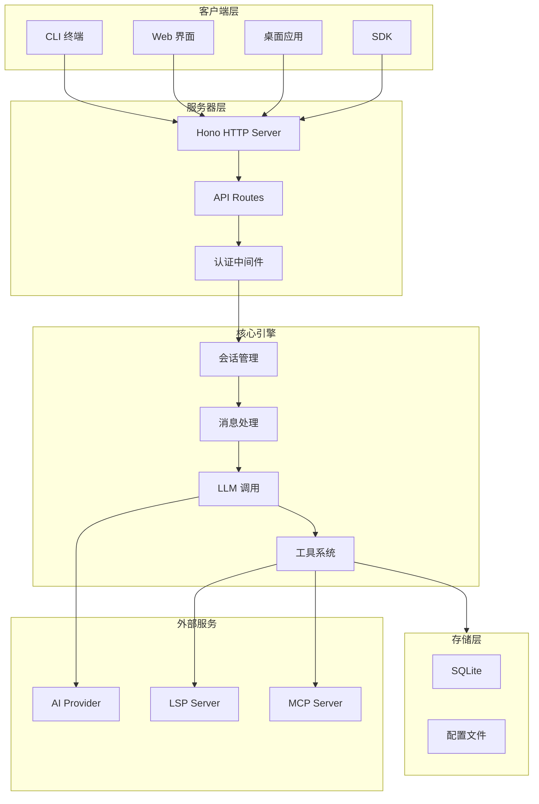

### 客户端架构

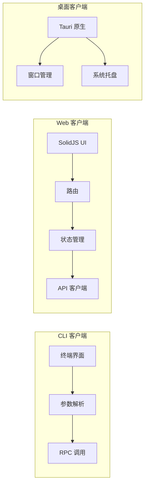

## 数据流图

### 消息处理流程

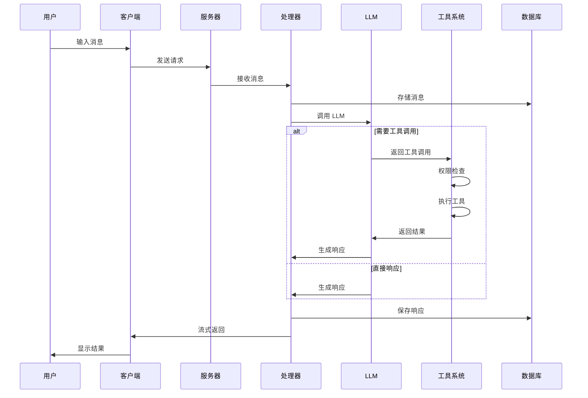

### 工具执行流程

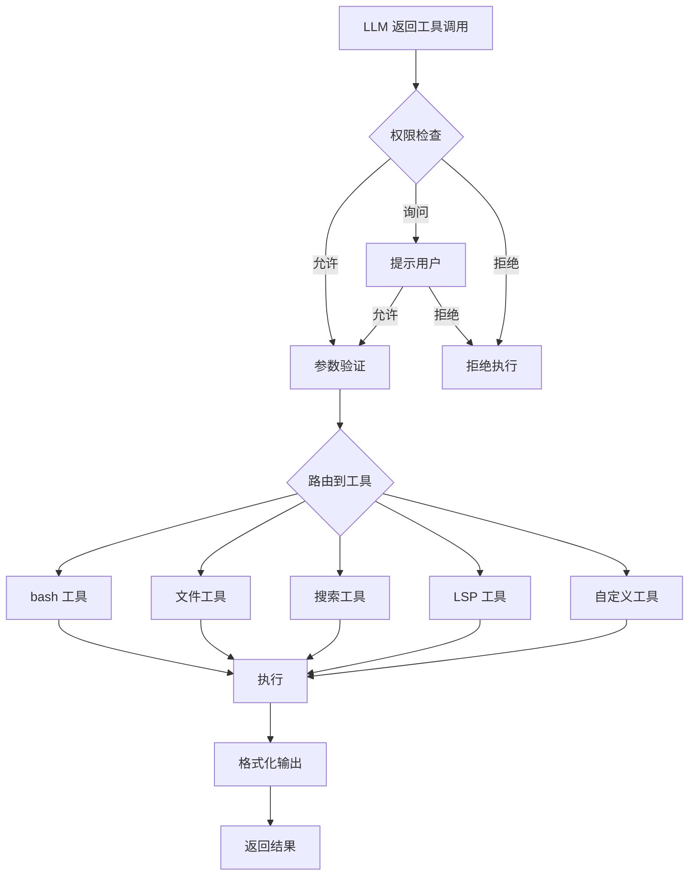

## 数据库模型

### 核心表关系

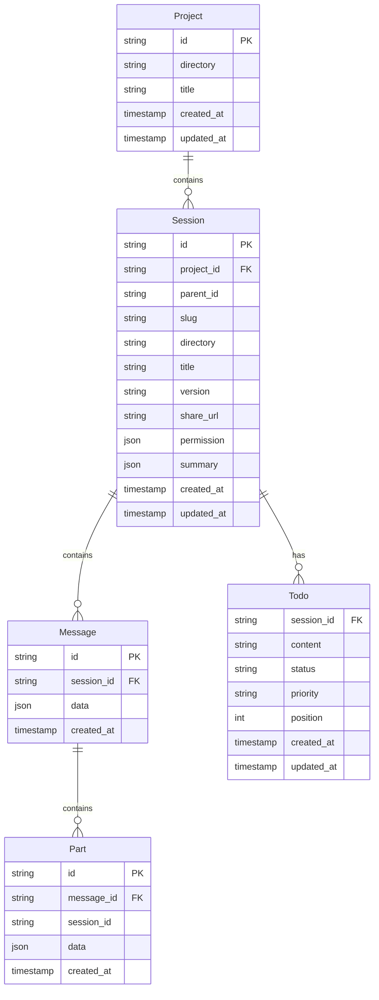

### 数据流转

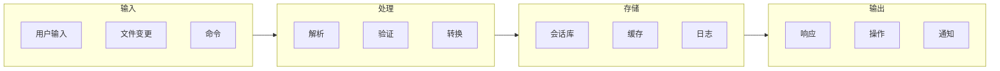

## 模块依赖

### 核心模块依赖图

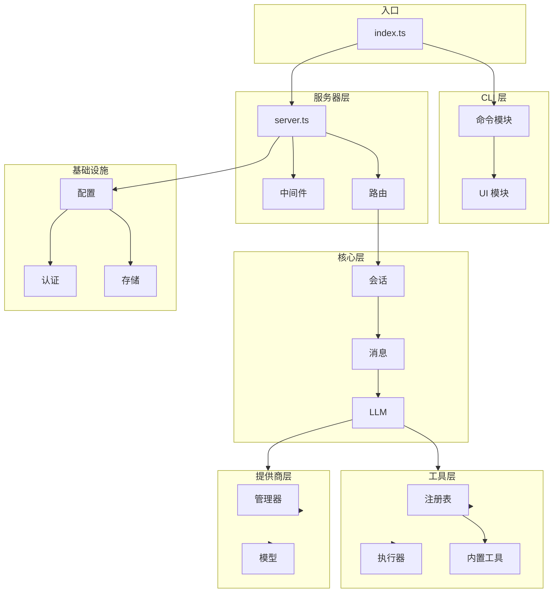

### 工具注册流程

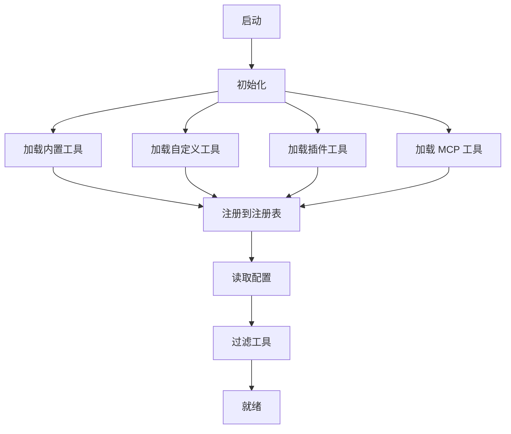

## 部署架构

### 开发环境

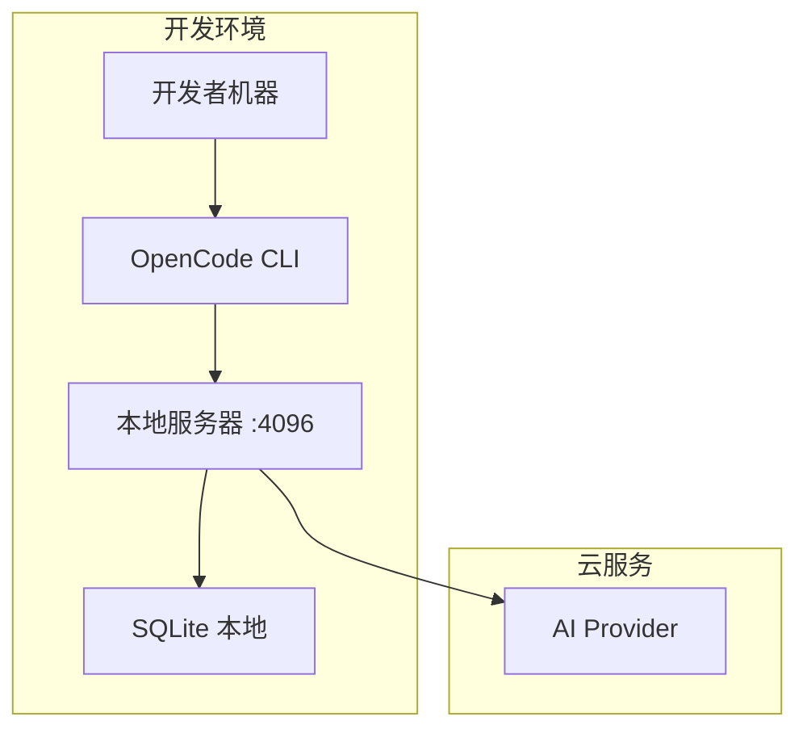

### 生产环境

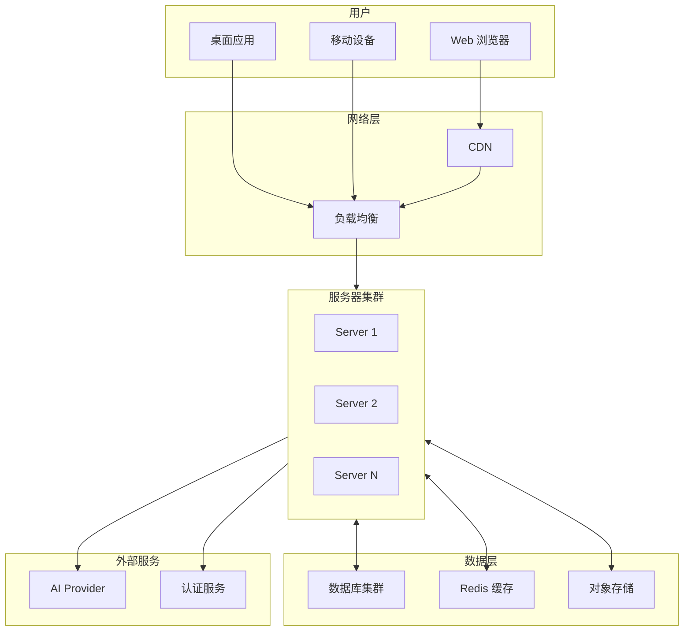

## 状态机

### 会话状态

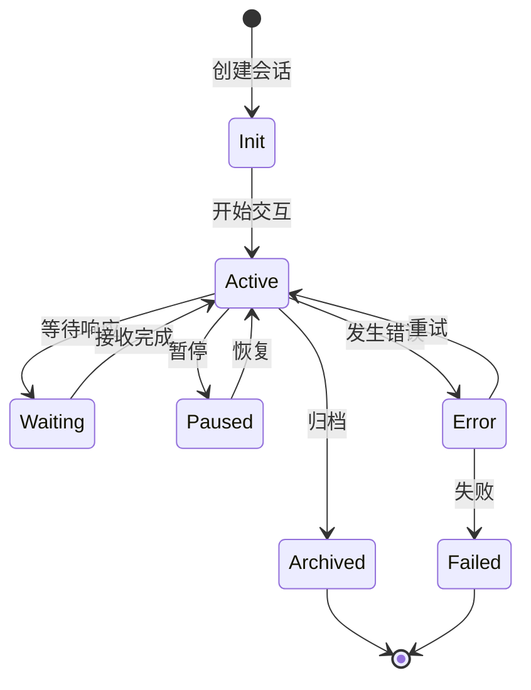

### 工具执行状态

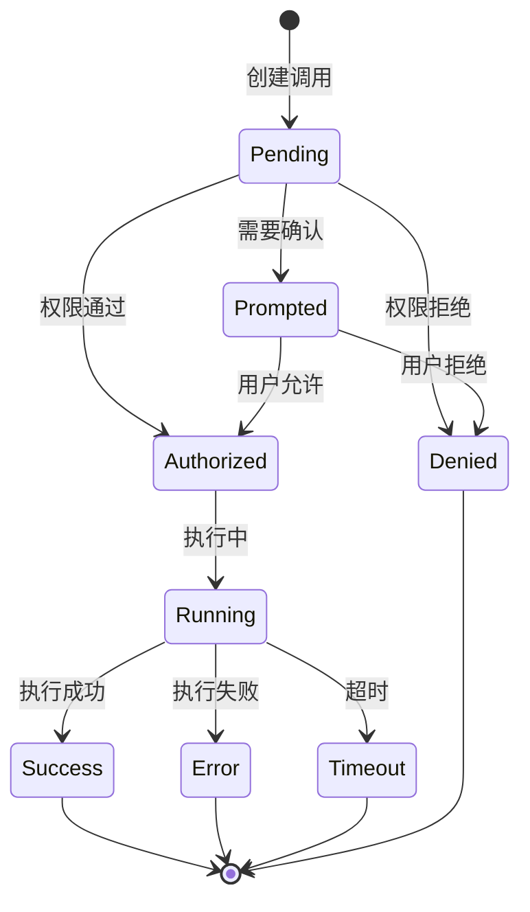

## 组件图

### 工具组件

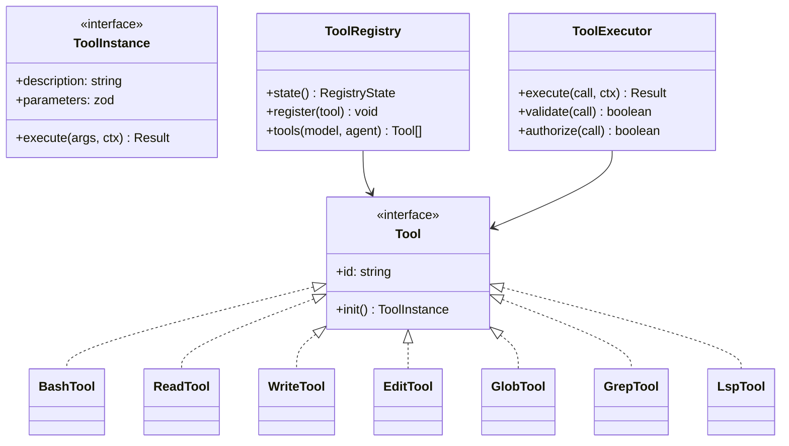

### Provider 组件

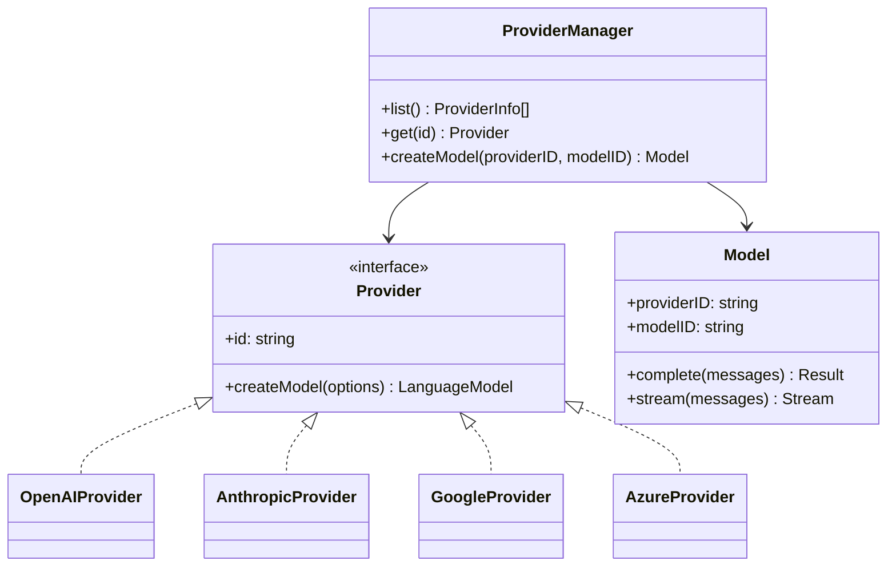

## 请求流程

### API 请求流程

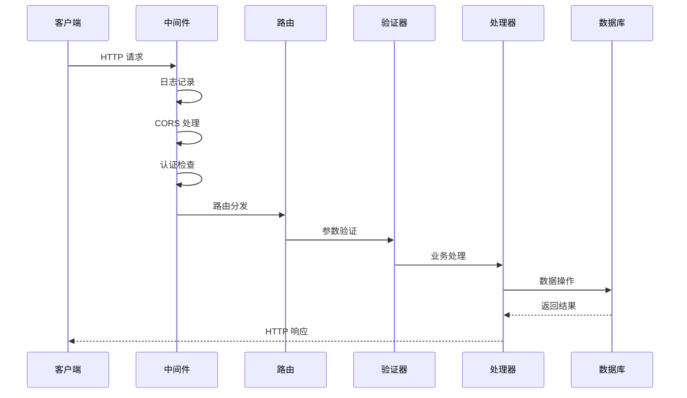

## 监控指标

### 关键指标

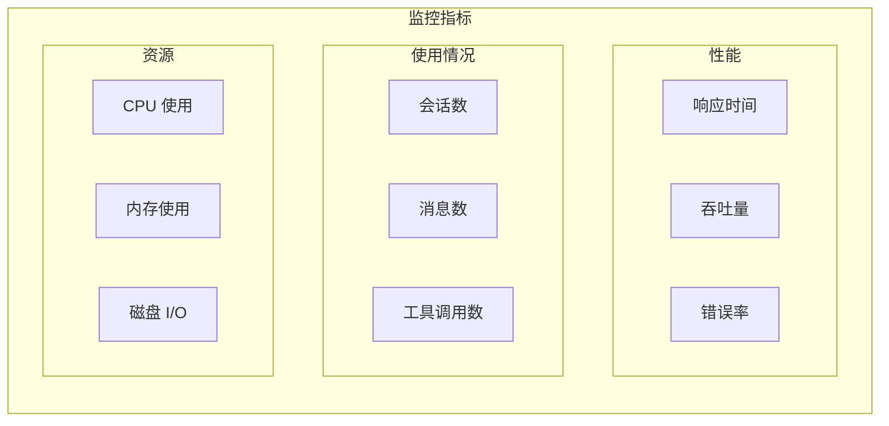
