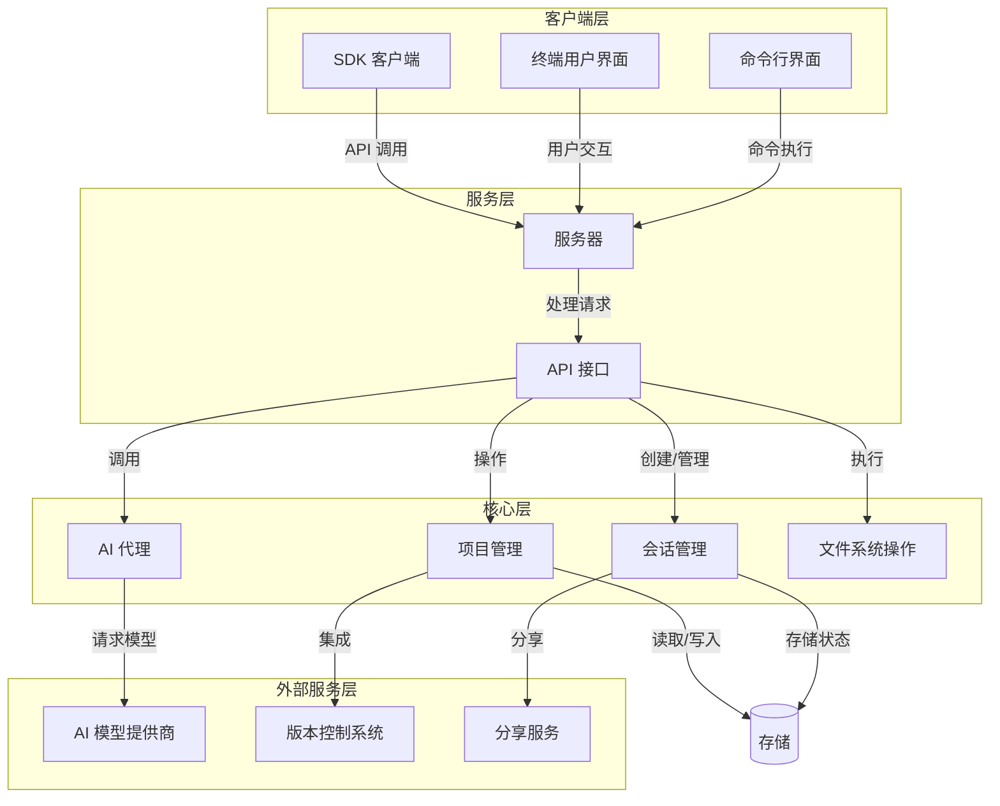
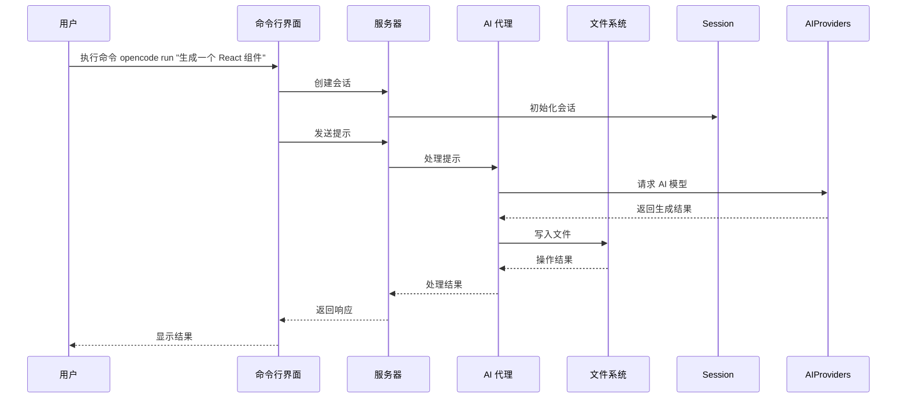
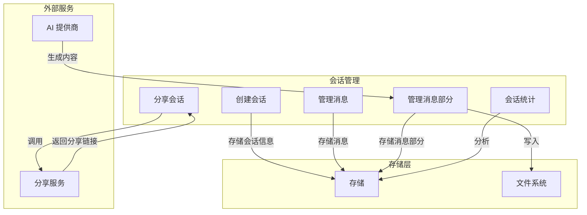
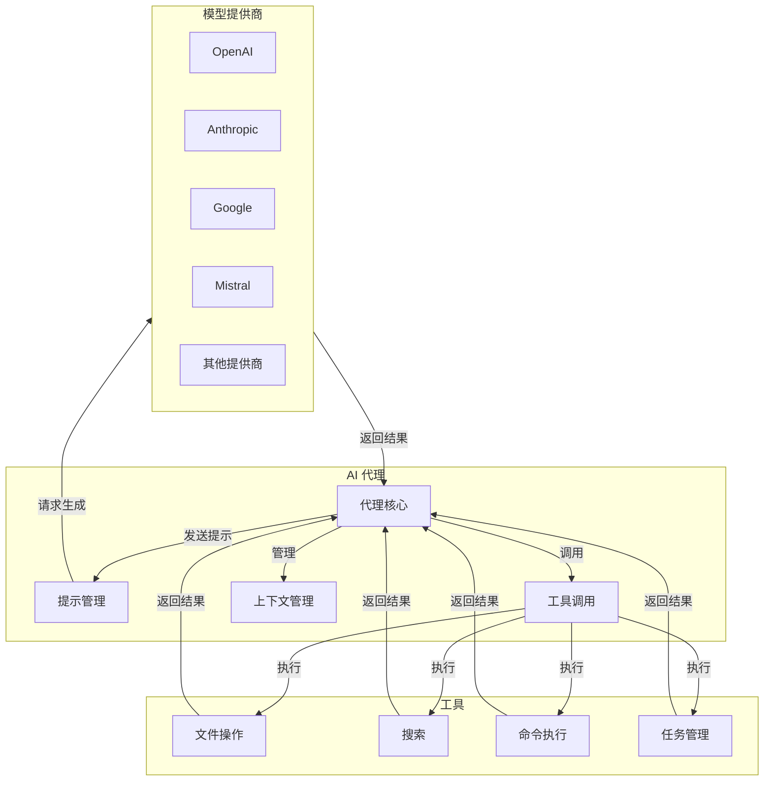
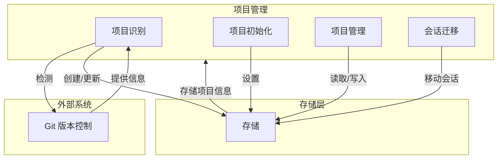
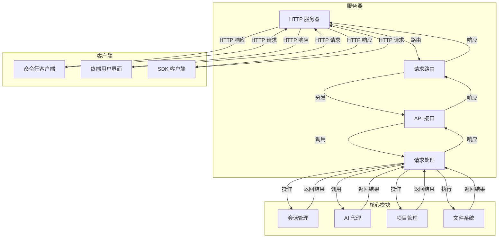
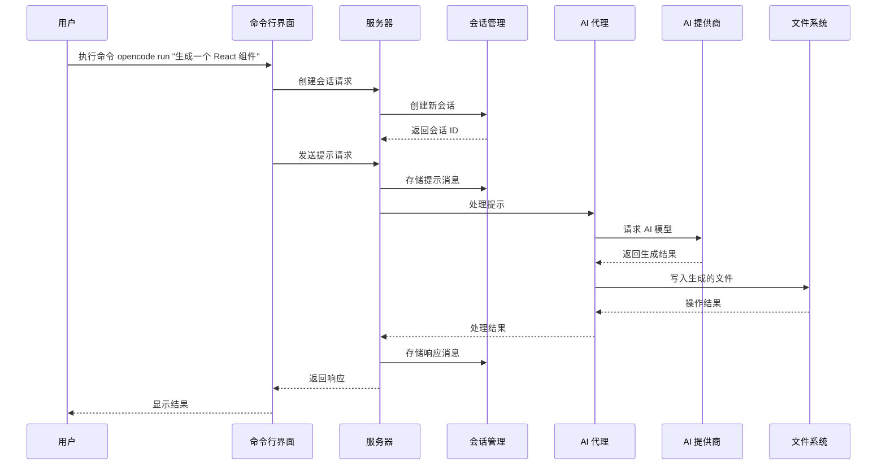
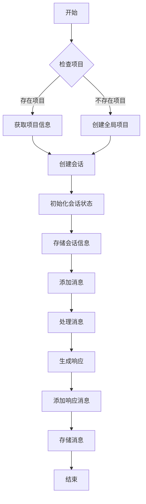
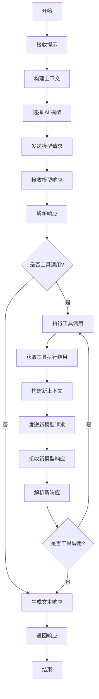

# OpenCode 源代码分析文档

## 1. 项目概览

OpenCode 是一个 AI 驱动的开发工具，提供了强大的 CLI 和 TUI（终端用户界面）交互方式，支持多种 AI 模型和提供商。它旨在帮助开发者更高效地完成各种开发任务，如代码生成、分析、搜索等。

### 主要功能
- AI 驱动的代码生成和分析
- 丰富的命令行工具和终端用户界面
- 支持多种 AI 模型和提供商
- 会话管理和状态持久化
- 文件操作和搜索功能
- 项目管理和版本控制集成

## 2. 目录结构

OpenCode 采用模块化的目录结构，清晰地分离了不同功能模块。核心代码位于 `packages/opencode/src` 目录，按照功能和职责划分为多个子目录。

```
src/
├── acp/                # Agent Client Protocol 相关代码
├── agent/              # AI 代理相关代码
├── auth/               # 认证相关代码
├── bun/                # Bun 运行时相关配置
├── bus/                # 事件总线实现
├── cli/                # 命令行界面代码
│   ├── cmd/            # 各种命令实现
│   │   ├── debug/      # 调试工具
│   │   ├── tui/        # 终端用户界面
│   │   ├── acp.ts      # ACP 命令
│   │   ├── agent.ts    # 代理命令
│   │   ├── auth.ts     # 认证命令
│   │   ├── cmd.ts      # 命令基础
│   │   ├── export.ts   # 导出命令
│   │   ├── generate.ts # 生成命令
│   │   ├── github.ts   # GitHub 命令
│   │   ├── import.ts   # 导入命令
│   │   ├── mcp.ts      # MCP 命令
│   │   ├── models.ts   # 模型命令
│   │   ├── pr.ts       # PR 命令
│   │   ├── run.ts      # 运行命令
│   │   ├── serve.ts    # 服务命令
│   │   ├── session.ts  # 会话命令
│   │   ├── stats.ts    # 统计命令
│   │   ├── uninstall.ts # 卸载命令
│   │   ├── upgrade.ts  # 升级命令
│   │   └── web.ts      # Web 命令
│   ├── bootstrap.ts    # 引导程序
│   ├── error.ts        # 错误处理
│   ├── network.ts      # 网络相关
│   ├── ui.ts           # UI 工具
│   └── upgrade.ts      # 升级相关
├── command/            # 命令定义和处理
├── config/             # 配置管理
├── env/                # 环境变量处理
├── file/               # 文件操作和搜索
├── flag/               # 命令行标志处理
├── format/             # 代码格式化
├── global/             # 全局状态和配置
├── id/                 # 标识符生成
├── ide/                # IDE 集成
├── installation/       # 安装和版本管理
├── lsp/                # 语言服务器协议实现
├── mcp/                # Model Context Protocol 相关代码
├── patch/              # 代码补丁处理
├── permission/         # 权限管理
├── plugin/             # 插件系统
├── project/            # 项目管理
├── provider/           # AI 模型提供商集成
│   ├── sdk/            # SDK 集成
│   ├── auth.ts         # 提供商认证
│   ├── models-macro.ts # 模型宏
│   ├── models.ts       # 模型管理
│   ├── provider.ts     # 提供商基础
│   └── transform.ts    # 转换工具
├── pty/                # 伪终端实现
├── server/             # 服务器实现
├── session/            # 会话管理
│   ├── prompt/         # 提示模板
│   ├── compaction.ts   # 压缩相关
│   ├── index.ts        # 会话入口
│   ├── llm.ts          # LLM 相关
│   ├── message-v2.ts   # 消息版本 2
│   ├── message.ts      # 消息处理
│   ├── processor.ts    # 处理器
│   ├── prompt.ts       # 提示处理
│   ├── retry.ts        # 重试机制
│   ├── revert.ts       # 回滚功能
│   ├── status.ts       # 状态管理
│   ├── summary.ts      # 摘要生成
│   ├── system.ts       # 系统相关
│   └── todo.ts         # 任务管理
├── share/              # 会话共享功能
└── index.ts            # 主入口文件
```

**目录结构说明：**

- **acp**: Agent Client Protocol 相关代码，用于与外部代理通信
- **agent**: AI 代理相关代码，处理与 AI 模型的交互
- **auth**: 认证相关代码，处理用户身份验证
- **bun**: Bun 运行时相关配置和工具
- **bus**: 事件总线实现，用于组件间通信
- **cli**: 命令行界面代码，包含各种命令实现
- **command**: 命令定义和处理
- **config**: 配置管理
- **env**: 环境变量处理
- **file**: 文件操作和搜索
- **flag**: 命令行标志处理
- **format**: 代码格式化
- **global**: 全局状态和配置
- **id**: 标识符生成
- **ide**: IDE 集成
- **installation**: 安装和版本管理
- **lsp**: 语言服务器协议实现
- **mcp**: Model Context Protocol 相关代码，用于模型上下文管理
- **patch**: 代码补丁处理
- **permission**: 权限管理
- **plugin**: 插件系统
- **project**: 项目管理
- **provider**: AI 模型提供商集成
- **pty**: 伪终端实现
- **server**: 服务器实现
- **session**: 会话管理
- **share**: 会话共享功能

## 3. 系统架构

OpenCode 采用分层架构设计，清晰地分离了不同职责的组件。系统由命令行界面、服务器、会话管理、AI 代理等核心模块组成，通过事件总线和 API 进行通信。



**架构说明：**

1. **客户端层**：
   - 命令行界面（CLI）：提供各种命令和工具
   - 终端用户界面（TUI）：提供交互式终端界面
   - SDK 客户端：用于与服务器通信的客户端库

2. **服务层**：
   - 服务器：处理客户端请求，管理核心功能
   - API 接口：定义和暴露系统功能

3. **核心层**：
   - 会话管理：处理用户会话和状态
   - AI 代理：与 AI 模型交互，处理 AI 相关任务
   - 项目管理：管理项目信息和状态
   - 文件系统操作：处理文件读写和搜索

4. **外部服务层**：
   - AI 模型提供商：如 OpenAI、Anthropic 等
   - 版本控制系统：如 Git
   - 分享服务：用于分享会话和结果

这种分层架构使得系统各组件职责清晰，易于维护和扩展。通过事件总线和 API 接口，各组件之间可以灵活通信，同时保持松耦合。

## 4. 核心模块分析

### 4.1 命令行界面（CLI）

CLI 模块是用户与 OpenCode 交互的主要入口点，提供了丰富的命令和选项。它使用 yargs 库来解析命令行参数，并根据用户输入执行相应的操作。

**主要命令：**
- `run`：运行 OpenCode 并发送消息
- `generate`：生成代码
- `auth`：处理认证
- `agent`：管理 AI 代理
- `upgrade`：升级 OpenCode
- `models`：管理 AI 模型
- `serve`：启动服务器
- `debug`：调试工具
- `stats`：查看统计信息
- `mcp`：管理模型上下文
- `github`：GitHub 集成
- `export`：导出数据
- `import`：导入数据
- `web`：启动 Web 界面
- `pr`：处理 Pull Request
- `session`：管理会话



**命令执行流程：**
1. 用户通过命令行输入命令和参数
2. CLI 解析命令并创建相应的命令处理器
3. 命令处理器与服务器通信，执行相应操作
4. 服务器调用 AI 代理处理 AI 相关任务
5. AI 代理与外部 AI 模型提供商通信
6. 服务器处理结果并返回给 CLI
7. CLI 显示结果给用户

### 4.2 会话管理

会话管理模块负责创建、维护和管理用户会话。每个会话包含一系列消息和操作，以及相关的状态和元数据。

**核心功能：**
- 创建和管理会话
- 存储和检索会话状态
- 处理会话消息和部分
- 会话分享和协作
- 会话统计和分析



**会话生命周期：**
1. 用户创建新会话或继续现有会话
2. 系统初始化会话状态并存储
3. 用户发送消息或执行命令
4. 系统处理消息并生成响应
5. 响应被分割为多个部分（如文本、工具调用等）
6. 系统存储消息和部分
7. 用户可以选择分享会话
8. 会话结束后，系统保存最终状态

### 4.3 AI 代理

AI 代理模块是 OpenCode 的核心，负责与各种 AI 模型交互，处理用户请求，生成响应。它支持多种 AI 模型和提供商，并提供了统一的接口来访问这些模型。

**核心功能：**
- 与多种 AI 模型提供商集成
- 处理提示和生成响应
- 管理模型参数和配置
- 工具调用和执行
- 会话上下文管理



**代理工作流程：**
1. 接收用户提示或命令
2. 构建提示上下文，包括历史消息和相关信息
3. 选择合适的 AI 模型和参数
4. 发送请求到 AI 模型提供商
5. 处理模型响应，包括文本生成和工具调用
6. 执行工具调用（如文件操作、搜索等）
7. 整合结果并返回给用户

### 4.4 项目管理

项目管理模块负责管理项目信息和状态，包括项目识别、初始化、配置等。它与版本控制系统（如 Git）集成，提供了项目级别的操作和状态管理。

**核心功能：**
- 项目识别和初始化
- 项目信息存储和检索
- 版本控制系统集成
- 项目会话管理
- 项目统计和分析



**项目处理流程：**
1. 系统检测当前目录是否为项目目录（如检测 .git 目录）
2. 如果是项目目录，系统获取项目信息并生成唯一标识符
3. 系统初始化项目配置和状态
4. 系统管理项目级别的会话和操作
5. 当项目结构变化时，系统更新项目信息

### 4.5 服务器

服务器模块提供了 HTTP 服务器实现，处理客户端请求并提供 API 接口。它是客户端与核心功能之间的桥梁，负责请求路由、处理和响应。

**核心功能：**
- HTTP 服务器实现
- API 接口定义和处理
- 请求路由和分发
- 会话管理和状态维护
- 错误处理和日志记录



**服务器工作流程：**
1. 客户端发送 HTTP 请求到服务器
2. 服务器解析请求并路由到相应的 API 接口
3. API 接口调用相应的处理函数
4. 处理函数调用核心模块执行操作
5. 核心模块返回结果给处理函数
6. 处理函数构建响应并返回给客户端
7. 服务器发送 HTTP 响应给客户端

## 5. 核心 API 和类

### 5.1 命令行入口（index.ts）

`index.ts` 是 OpenCode 的主入口文件，负责解析命令行参数并执行相应的命令。

**主要功能：**
- 解析命令行参数
- 初始化日志系统
- 注册各种命令
- 处理命令执行和错误

**核心代码：**
```typescript
const cli = yargs(hideBin(process.argv))
  .parserConfiguration({ "populate--": true })
  .scriptName("opencode")
  .wrap(100)
  .help("help", "show help")
  .alias("help", "h")
  .version("version", "show version number", Installation.VERSION)
  .alias("version", "v")
  // ... 其他配置 ...
  .command(AcpCommand)
  .command(McpCommand)
  .command(TuiThreadCommand)
  .command(TuiSpawnCommand)
  .command(AttachCommand)
  .command(RunCommand)
  .command(GenerateCommand)
  // ... 其他命令 ...
  .strict()

try {
  await cli.parse()
} catch (e) {
  // ... 错误处理 ...
}
```

### 5.2 会话管理（Session）

`Session` 命名空间提供了会话管理的核心功能，包括创建、获取、更新会话等。

**主要方法：**
- `create()`: 创建新会话
- `get()`: 获取会话信息
- `update()`: 更新会话信息
- `messages()`: 获取会话消息
- `share()`: 分享会话
- `remove()`: 删除会话

**核心代码：**
```typescript
export namespace Session {
  // ... 其他代码 ...

  export const create = fn(
    z
      .object({
        parentID: Identifier.schema("session").optional(),
        title: z.string().optional(),
        permission: Info.shape.permission,
      })
      .optional(),
    async (input) => {
      return createNext({
        parentID: input?.parentID,
        directory: Instance.directory,
        title: input?.title,
        permission: input?.permission,
      })
    },
  )

  // ... 其他方法 ...
}
```

### 5.3 项目管理（Project）

`Project` 命名空间提供了项目管理的核心功能，包括项目识别、初始化、更新等。

**主要方法：**
- `fromDirectory()`: 从目录创建项目
- `list()`: 列出所有项目
- `update()`: 更新项目信息
- `setInitialized()`: 标记项目为已初始化
- `sandboxes()`: 获取项目沙箱目录

**核心代码：**
```typescript
export namespace Project {
  // ... 其他代码 ...

  export async function fromDirectory(directory: string) {
    log.info("fromDirectory", { directory })

    const { id, sandbox, worktree, vcs } = await iife(async () => {
      const matches = Filesystem.up({ targets: [".git"], start: directory })
      const git = await matches.next().then((x) => x.value)
      await matches.return()
      if (git) {
        // ... 处理 git 项目 ...
      }

      return {
        id: "global",
        worktree: "/",
        sandbox: "/",
        vcs: Info.shape.vcs.parse(Flag.OPENCODE_FAKE_VCS),
      }
    })

    // ... 其他代码 ...
  }

  // ... 其他方法 ...
}
```

### 5.4 AI 代理（Agent）

`Agent` 类提供了 AI 代理的核心功能，包括处理提示、调用工具等。

**主要方法：**
- `get()`: 获取代理信息
- `generate()`: 生成内容
- `process()`: 处理提示
- `execute()`: 执行工具调用

**核心代码：**
```typescript
export class Agent {
  // ... 其他代码 ...

  static async get(id: string) {
    const agent = await Storage.read<Agent.Info>(["agent", id]).catch(() => undefined)
    return agent
  }

  // ... 其他方法 ...
}
```

### 5.5 服务器（Server）

`Server` 类提供了 HTTP 服务器的实现，处理客户端请求并提供 API 接口。

**主要方法：**
- `listen()`: 启动服务器
- `stop()`: 停止服务器
- `handleRequest()`: 处理 HTTP 请求

**核心代码：**
```typescript
export class Server {
  // ... 其他代码 ...

  static listen(options: { port: number; hostname: string }) {
    const server = Bun.serve({
      port: options.port,
      hostname: options.hostname,
      async fetch(req) {
        return Server.handleRequest(req)
      },
    })
    return server
  }

  // ... 其他方法 ...
}
```

## 6. 关键流程分析

### 6.1 命令执行流程

命令执行是 OpenCode 的核心流程之一，从用户输入命令到执行完成的整个过程。



**流程说明：**
1. 用户通过命令行输入命令和参数
2. CLI 解析命令并向服务器发送创建会话请求
3. 服务器创建新会话并返回会话 ID
4. CLI 向服务器发送提示请求，包含用户输入的提示内容
5. 服务器存储提示消息并调用 AI 代理处理
6. AI 代理向 AI 提供商发送请求
7. AI 提供商返回生成结果
8. AI 代理执行必要的文件操作
9. AI 代理将处理结果返回给服务器
10. 服务器存储响应消息并返回给 CLI
11. CLI 显示结果给用户

### 6.2 会话创建和管理流程

会话创建和管理是 OpenCode 的另一个核心流程，涉及会话的初始化、消息处理和状态管理。



**流程说明：**
1. 系统检查当前目录是否为项目目录
2. 如果是项目目录，获取项目信息；否则创建全局项目
3. 系统创建新会话并初始化会话状态
4. 系统存储会话信息到存储层
5. 用户添加消息到会话
6. 系统处理消息并生成响应
7. 系统添加响应消息到会话
8. 系统存储消息到存储层
9. 流程结束

### 6.3 AI 代理处理流程

AI 代理处理是 OpenCode 的核心流程之一，涉及提示处理、模型调用和工具执行。



**流程说明：**
1. AI 代理接收用户提示
2. 代理构建包含历史消息和上下文的提示
3. 代理选择合适的 AI 模型
4. 代理向 AI 模型发送请求
5. 代理接收模型响应
6. 代理解析响应
7. 如果响应包含工具调用，代理执行相应工具
8. 如果响应不包含工具调用，代理生成文本响应
9. 工具执行完成后，代理构建新上下文并再次请求模型
10. 代理返回最终响应

## 7. 技术栈和依赖

OpenCode 使用了现代 JavaScript/TypeScript 技术栈，主要依赖包括：

| 类别 | 技术/库 | 用途 | 来源 |
|------|---------|------|------|
| 运行时 | Bun | 现代 JavaScript 运行时，提供更快的执行速度 | package.json |
| 前端框架 | SolidJS | 用于构建 TUI 界面 | package.json |
| UI 库 | OpenTUI | 终端用户界面库 | package.json |
| 命令行 | yargs | 命令行参数解析 | src/index.ts |
| 存储 | Bun 文件系统 API | 本地存储和文件操作 | 多个文件 |
| AI 集成 | AI SDK | 与多种 AI 模型提供商集成 | package.json |
| 网络 | fetch API | HTTP 请求和响应 | 多个文件 |
| 工具 | ripgrep | 快速文件搜索 | 多个文件 |
| 版本控制 | Git | 项目版本控制集成 | src/project/project.ts |
| 构建工具 | Bun 构建工具 | 项目构建和打包 | script/build.ts |

**核心依赖：**
- **Bun**: 现代 JavaScript 运行时，提供更快的执行速度和更好的开发体验
- **SolidJS**: 用于构建 TUI 界面的前端框架
- **OpenTUI**: 终端用户界面库，提供丰富的终端 UI 组件
- **AI SDK**: 与多种 AI 模型提供商集成的 SDK，支持 OpenAI、Anthropic、Google 等
- **yargs**: 命令行参数解析库，提供丰富的命令行选项和帮助信息

## 8. 代码亮点和最佳实践

### 8.1 模块化设计

OpenCode 采用了高度模块化的设计，将不同功能划分为独立的模块，每个模块负责特定的功能。这种设计使得代码结构清晰，易于维护和扩展。

**优点：**
- 代码结构清晰，易于理解和维护
- 模块之间边界明确，减少耦合
- 便于团队协作和并行开发
- 便于测试和调试

### 8.2 类型安全

OpenCode 使用 TypeScript 开发，充分利用了 TypeScript 的类型系统，提供了良好的类型安全性。它使用 Zod 库进行运行时类型验证，确保数据的一致性和正确性。

**优点：**
- 编译时类型检查，减少运行时错误
- 更好的代码提示和自动补全
- 更清晰的代码结构和意图
- 运行时类型验证，确保数据一致性

### 8.3 事件驱动架构

OpenCode 使用事件总线实现了事件驱动架构，组件之间通过事件进行通信，减少了直接依赖和耦合。

**优点：**
- 组件之间松耦合，便于维护和扩展
- 事件处理逻辑集中，便于管理
- 支持异步处理和并发操作
- 便于测试和模拟

### 8.4 插件系统

OpenCode 实现了插件系统，允许扩展其功能和集成第三方服务。

**优点：**
- 系统功能可扩展，支持自定义功能
- 便于集成第三方服务和工具
- 插件可以独立开发和维护
- 提供了统一的插件接口和生命周期管理

### 8.5 错误处理

OpenCode 实现了全面的错误处理机制，包括同步和异步错误处理，以及详细的错误日志和报告。

**优点：**
- 错误处理集中，便于管理和调试
- 详细的错误日志，便于问题定位
- 友好的错误提示，提高用户体验
- 错误边界处理，防止系统崩溃

## 9. 总结与亮点回顾

OpenCode 是一个功能强大的 AI 驱动开发工具，通过整合多种 AI 模型和提供商，为开发者提供了高效的开发辅助功能。它的核心优势包括：

### 核心亮点

1. **模块化架构**：采用高度模块化的设计，代码结构清晰，易于维护和扩展。
2. **多模型支持**：集成了多种 AI 模型和提供商，包括 OpenAI、Anthropic、Google 等。
3. **丰富的界面**：提供了命令行界面和终端用户界面，满足不同用户的需求。
4. **会话管理**：强大的会话管理功能，支持会话持久化、分享和协作。
5. **项目集成**：与版本控制系统（如 Git）集成，提供项目级别的操作和状态管理。
6. **文件操作**：丰富的文件操作和搜索功能，便于代码分析和修改。
7. **事件驱动**：采用事件驱动架构，组件之间松耦合，便于维护和扩展。
8. **类型安全**：使用 TypeScript 开发，充分利用类型系统和运行时验证，提高代码质量。
9. **插件系统**：支持插件扩展，便于集成第三方服务和工具。
10. **错误处理**：全面的错误处理机制，提高系统稳定性和用户体验。

### 技术创新

1. **多模型集成**：通过统一的接口集成多种 AI 模型和提供商，为用户提供更多选择。
2. **终端用户界面**：使用 SolidJS 和 OpenTUI 构建现代化的终端用户界面，提供丰富的交互体验。
3. **会话管理**：强大的会话管理功能，支持会话持久化、分享和协作。
4. **项目感知**：自动检测和管理项目，提供项目级别的操作和状态管理。
5. **工具调用**：支持 AI 模型调用各种工具，如文件操作、搜索等，扩展了 AI 的能力。

### 应用场景

1. **代码生成**：生成各种编程语言的代码，如 JavaScript、TypeScript、Python 等。
2. **代码分析**：分析代码结构和质量，提供改进建议。
3. **代码搜索**：快速搜索和定位代码，提高开发效率。
4. **文档生成**：根据代码生成文档和注释。
5. **测试生成**：生成测试用例，提高代码覆盖率。
6. **重构建议**：提供代码重构建议，改善代码质量。
7. **技术研究**：快速研究和学习新技术和框架。

OpenCode 代表了 AI 辅助开发工具的未来发展方向，通过整合多种 AI 模型和提供商，为开发者提供了强大的开发辅助功能，有望显著提高开发效率和代码质量。

## 10. 未来发展建议

基于对 OpenCode 源代码的分析，以下是一些未来发展建议：

1. **增强模型集成**：继续扩展对更多 AI 模型和提供商的支持，包括开源模型和本地部署模型。
2. **改进用户界面**：进一步优化终端用户界面，提供更多个性化选项和主题。
3. **增强插件系统**：完善插件系统，提供更多插件 API 和文档，鼓励社区贡献插件。
4. **改进性能**：优化系统性能，减少响应时间，提高处理大型项目的能力。
5. **增强安全性**：加强系统安全性，特别是在处理敏感代码和数据时。
6. **扩展平台支持**：支持更多操作系统和平台，如 Windows、Linux、macOS 等。
7. **增强协作功能**：提供更多协作功能，如实时共享会话、多人编辑等。
8. **改进文档**：提供更详细的文档和教程，帮助用户更好地使用系统。
9. **增强 IDE 集成**：与更多 IDE 和编辑器集成，提供更无缝的开发体验。
10. **开放 API**：提供开放 API，允许其他工具和服务集成 OpenCode 的功能。

通过不断改进和扩展，OpenCode 有望成为开发者的重要助手，显著提高开发效率和代码质量。