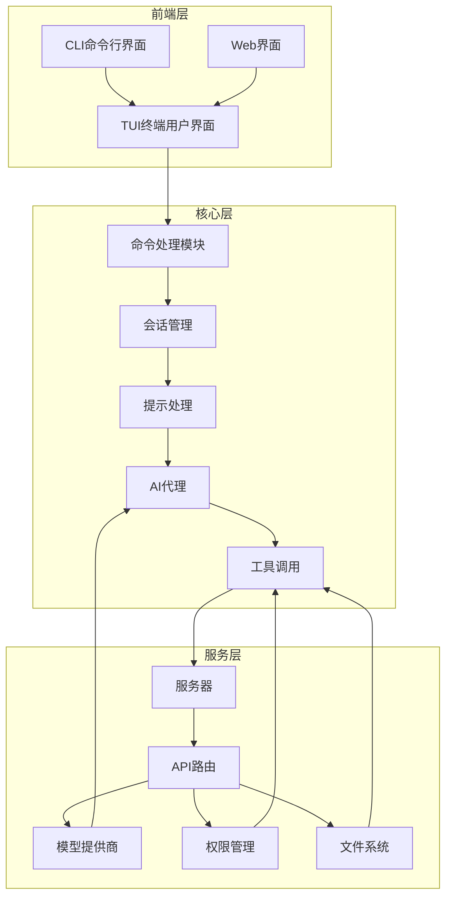
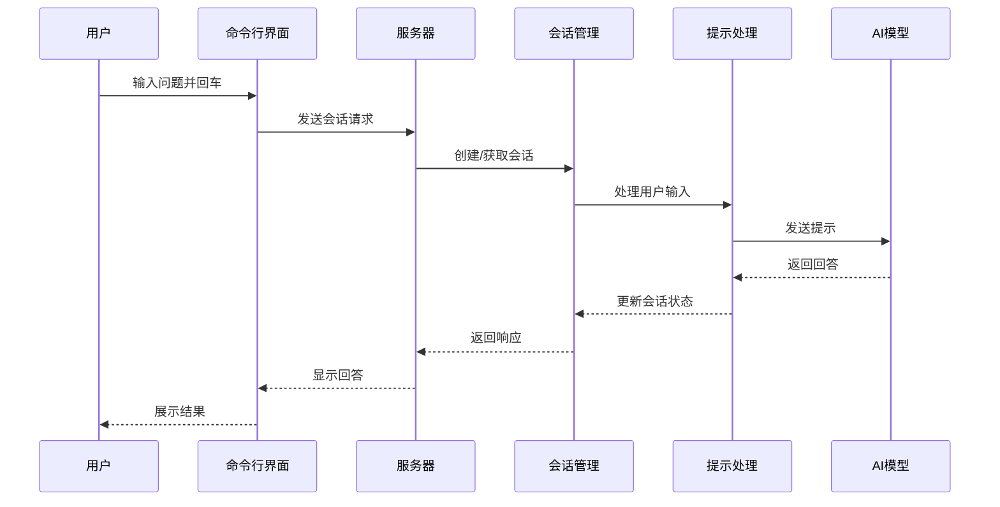
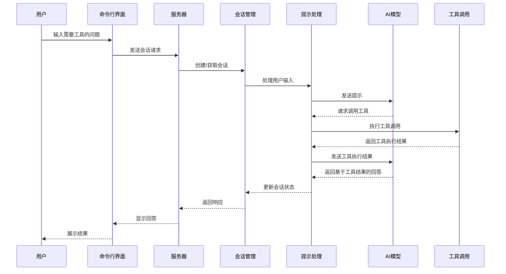
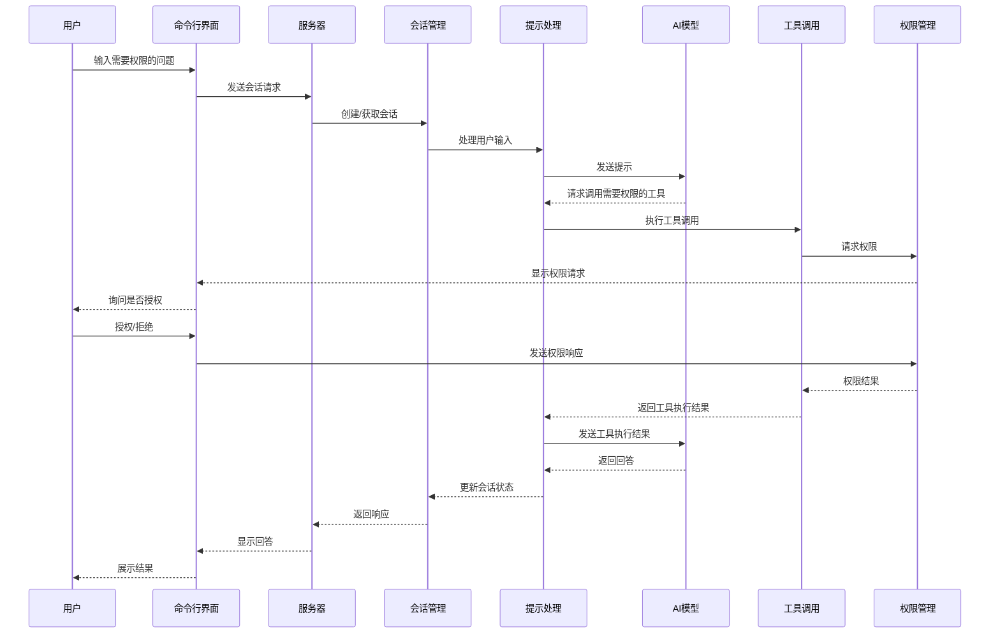
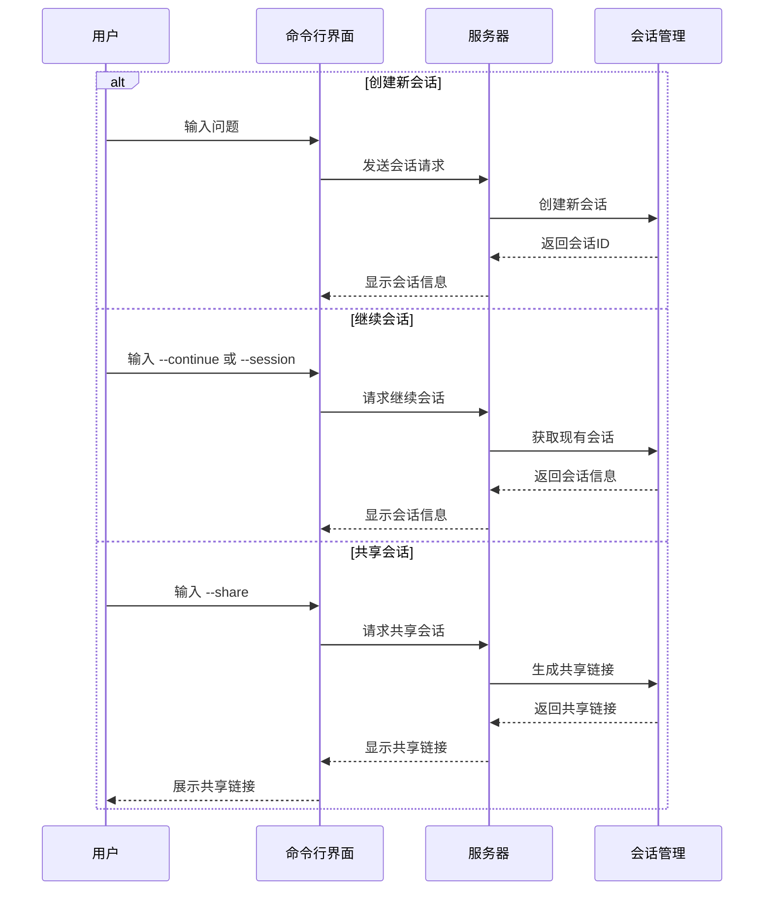
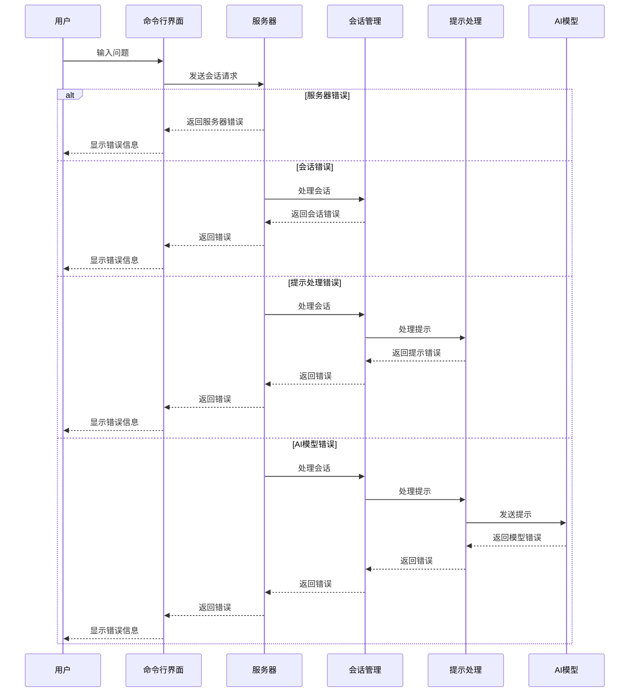
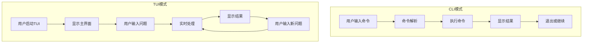
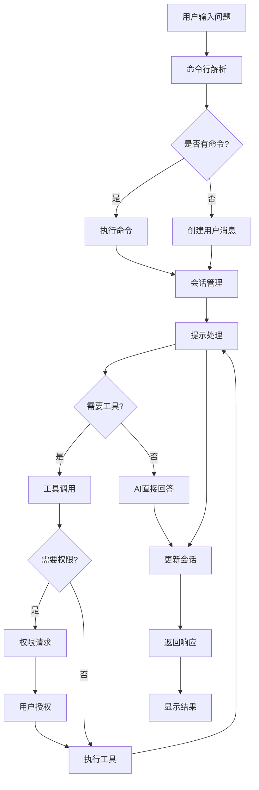
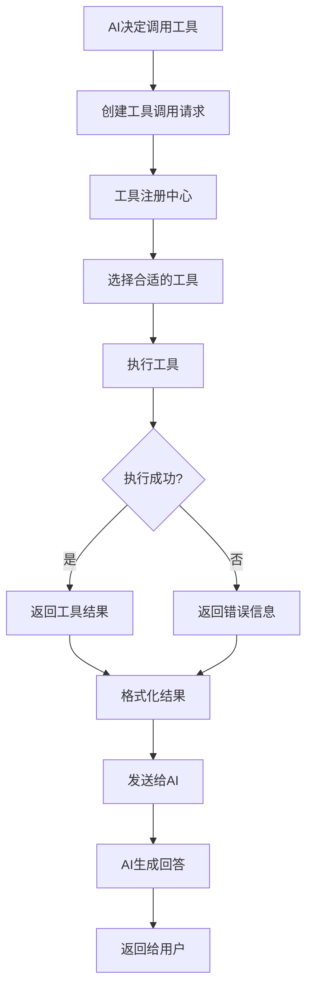

# OpenCode 用户输入处理流程分析

本文档详细分析了 OpenCode 启动后，用户输入问题并按下回车后的处理流程。通过分析不同场景的流程，帮助您更好地理解 OpenCode 的内部工作原理。

## 1. 整体架构概览

在深入了解具体场景之前，让我们先了解 OpenCode 的整体架构，这有助于理解用户输入处理的上下文。



OpenCode 采用分层架构设计，将用户界面、核心处理逻辑和服务层清晰分离。当用户输入问题并按下回车后，输入会经过命令处理模块，进入会话管理系统，然后由提示处理模块处理，最终通过 AI 代理生成响应。整个流程中可能涉及工具调用、权限管理、文件系统操作等多个环节。

## 2. 场景分析

### 2.1 正常流程：直接回答

当用户输入一个简单问题，AI 可以直接回答而不需要使用工具时，流程如下：



**流程说明**：
1. 用户在命令行界面输入问题并按下回车
2. 命令行界面将输入发送到服务器
3. 服务器创建或获取现有会话
4. 会话管理模块将用户输入传递给提示处理模块
5. 提示处理模块格式化输入并发送给 AI 模型
6. AI 模型生成回答并返回给提示处理模块
7. 提示处理模块更新会话状态
8. 会话管理模块将响应返回给服务器
9. 服务器将回答发送回命令行界面
10. 命令行界面展示结果给用户

### 2.2 带工具调用的流程

当用户输入的问题需要 AI 使用工具来回答时，流程如下：



**流程说明**：
1. 用户输入需要工具的问题（例如，"查看当前目录下的文件"）
2. 命令行界面将输入发送到服务器
3. 服务器创建或获取现有会话
4. 会话管理模块将用户输入传递给提示处理模块
5. 提示处理模块格式化输入并发送给 AI 模型
6. AI 模型分析问题并确定需要调用工具
7. 提示处理模块执行工具调用（例如，调用 `list` 工具）
8. 工具执行并返回结果
9. 提示处理模块将工具执行结果发送给 AI 模型
10. AI 模型基于工具结果生成回答
11. 提示处理模块更新会话状态
12. 会话管理模块将响应返回给服务器
13. 服务器将回答发送回命令行界面
14. 命令行界面展示结果给用户

### 2.3 权限请求流程

当 AI 需要执行需要权限的操作时，流程如下：



**流程说明**：
1. 用户输入需要权限的问题（例如，"删除某个文件"）
2. 命令行界面将输入发送到服务器
3. 服务器创建或获取现有会话
4. 会话管理模块将用户输入传递给提示处理模块
5. 提示处理模块格式化输入并发送给 AI 模型
6. AI 模型分析问题并确定需要调用需要权限的工具
7. 提示处理模块执行工具调用
8. 工具调用权限管理模块请求权限
9. 权限管理模块向命令行界面发送权限请求
10. 命令行界面询问用户是否授权
11. 用户选择授权或拒绝
12. 命令行界面将权限响应发送给权限管理模块
13. 权限管理模块将权限结果返回给工具
14. 工具执行并返回结果
15. 提示处理模块将工具执行结果发送给 AI 模型
16. AI 模型基于工具结果生成回答
17. 提示处理模块更新会话状态
18. 会话管理模块将响应返回给服务器
19. 服务器将回答发送回命令行界面
20. 命令行界面展示结果给用户

### 2.4 会话管理流程

用户创建、继续或共享会话的流程如下：



**流程说明**：

1. **创建新会话**：
   - 用户输入问题
   - 命令行界面发送会话请求
   - 服务器创建新会话
   - 会话管理模块返回会话ID
   - 服务器显示会话信息

2. **继续会话**：
   - 用户使用 `--continue` 或 `--session` 参数
   - 命令行界面请求继续会话
   - 服务器获取现有会话
   - 会话管理模块返回会话信息
   - 服务器显示会话信息

3. **共享会话**：
   - 用户使用 `--share` 参数
   - 命令行界面请求共享会话
   - 服务器生成共享链接
   - 会话管理模块返回共享链接
   - 服务器显示共享链接
   - 命令行界面展示共享链接给用户

### 2.5 错误处理流程

当系统遇到错误时的处理流程如下：



**流程说明**：

1. **服务器错误**：
   - 服务器无法处理请求
   - 服务器返回错误
   - 命令行界面显示错误信息给用户

2. **会话错误**：
   - 服务器尝试处理会话
   - 会话管理模块返回错误
   - 服务器返回错误
   - 命令行界面显示错误信息给用户

3. **提示处理错误**：
   - 服务器处理会话
   - 会话管理模块将输入传递给提示处理模块
   - 提示处理模块返回错误
   - 会话管理模块返回错误
   - 服务器返回错误
   - 命令行界面显示错误信息给用户

4. **AI模型错误**：
   - 服务器处理会话
   - 会话管理模块将输入传递给提示处理模块
   - 提示处理模块将输入发送给 AI 模型
   - AI 模型返回错误
   - 提示处理模块返回错误
   - 会话管理模块返回错误
   - 服务器返回错误
   - 命令行界面显示错误信息给用户

### 2.6 不同模式流程：CLI vs TUI

OpenCode 支持两种主要的用户界面模式：CLI（命令行界面）和 TUI（终端用户界面）。以下是两种模式的流程差异：



**流程说明**：

1. **CLI模式**：
   - 用户输入完整命令
   - 命令解析模块解析命令
   - 执行命令并处理输入
   - 显示结果
   - 退出或等待用户输入新命令

2. **TUI模式**：
   - 用户启动 TUI 界面
   - 显示交互式主界面
   - 用户在界面中输入问题
   - 系统实时处理输入
   - 实时显示结果
   - 用户可以直接输入新问题，无需重新启动

## 3. 核心代码分析

### 3.1 命令处理入口

命令处理的核心代码位于 `src/cli/cmd/run.ts` 文件中，负责处理用户输入并启动相应的处理流程：

```typescript
// src/cli/cmd/run.ts
const execute = async (sdk: OpencodeClient, sessionID: string) => {
  // 处理事件和输出
  const printEvent = (color: string, type: string, title: string) => {
    UI.println(
      color + `|`,
      UI.Style.TEXT_NORMAL + UI.Style.TEXT_DIM + ` ${type.padEnd(7, " ")}`,
      "",
      UI.Style.TEXT_NORMAL + title,
    )
  }

  // 订阅事件流
  const events = await sdk.event.subscribe()
  let errorMsg: string | undefined

  // 处理各种事件
  const eventProcessor = (async () => {
    for await (const event of events.stream) {
      // 处理消息更新事件
      if (event.type === "message.part.updated") {
        const part = event.properties.part
        if (part.sessionID !== sessionID) continue

        // 处理工具调用完成事件
        if (part.type === "tool" && part.state.status === "completed") {
          // 显示工具调用结果
        }

        // 处理文本消息完成事件
        if (part.type === "text" && part.time?.end) {
          // 显示文本结果
        }
      }

      // 处理会话错误事件
      if (event.type === "session.error") {
        // 处理错误
      }

      // 处理权限请求事件
      if (event.type === "permission.asked") {
        // 处理权限请求
      }
    }
  })()

  // 执行命令或提示
  if (args.command) {
    await sdk.session.command({
      sessionID,
      agent: resolvedAgent,
      model: args.model,
      command: args.command,
      arguments: message,
      variant: args.variant,
    })
  } else {
    const modelParam = args.model ? Provider.parseModel(args.model) : undefined
    await sdk.session.prompt({
      sessionID,
      agent: resolvedAgent,
      model: modelParam,
      variant: args.variant,
      parts: [...fileParts, { type: "text", text: message }],
    })
  }

  await eventProcessor
  if (errorMsg) process.exit(1)
}
```

### 3.2 提示处理核心

提示处理的核心代码位于 `src/session/prompt.ts` 文件中，负责处理用户输入并生成响应：

```typescript
// src/session/prompt.ts
export const prompt = fn(PromptInput, async (input) => {
  const session = await Session.get(input.sessionID)
  await SessionRevert.cleanup(session)

  const message = await createUserMessage(input)
  await Session.touch(input.sessionID)

  // 处理权限
  const permissions: PermissionNext.Ruleset = []
  for (const [tool, enabled] of Object.entries(input.tools ?? {})) {
    permissions.push({
      permission: tool,
      action: enabled ? "allow" : "deny",
      pattern: "*",
    })
  }
  if (permissions.length > 0) {
    session.permission = permissions
    await Session.update(session.id, (draft) => {
      draft.permission = permissions
    })
  }

  if (input.noReply === true) {
    return message
  }

  return loop(input.sessionID)
})

// 处理循环，处理多个步骤
const loop = async (sessionID) => {
  const abort = start(sessionID)
  if (!abort) {
    return new Promise<MessageV2.WithParts>((resolve, reject) => {
      const callbacks = state()[sessionID].callbacks
      callbacks.push({ resolve, reject })
    })
  }

  using _ = defer(() => cancel(sessionID))

  let step = 0
  const session = await Session.get(sessionID)
  while (true) {
    SessionStatus.set(sessionID, { type: "busy" })
    // 处理消息流
    let msgs = await MessageV2.filterCompacted(MessageV2.stream(sessionID))

    // 查找最后一条用户消息和助手消息
    let lastUser: MessageV2.User | undefined
    let lastAssistant: MessageV2.Assistant | undefined
    let lastFinished: MessageV2.Assistant | undefined
    let tasks: (MessageV2.CompactionPart | MessageV2.SubtaskPart)[] = []
    
    // 处理不同类型的任务
    // 1. 子任务处理
    // 2. 压缩处理
    // 3. 上下文溢出处理
    // 4. 正常处理

    // 正常处理
    const agent = await Agent.get(lastUser.agent)
    const maxSteps = agent.steps ?? Infinity
    const isLastStep = step >= maxSteps
    msgs = insertReminders({ messages: msgs, agent })

    const processor = SessionProcessor.create({
      // 创建处理器
    })
    const tools = await resolveTools({
      // 解析工具
    })

    // 处理消息
    const result = await processor.process({
      user: lastUser,
      agent,
      abort,
      sessionID,
      system: [...(await SystemPrompt.environment()), ...(await SystemPrompt.custom())],
      messages: [
        ...MessageV2.toModelMessage(sessionMessages),
        ...(isLastStep ? [{ role: "assistant" as const, content: MAX_STEPS }] : []),
      ],
      tools,
      model,
    })
  }
}
```

### 3.3 服务器处理

服务器处理的核心代码位于 `src/server/server.ts` 文件中，负责处理 API 请求和响应：

```typescript
// src/server/server.ts
app.post(
  "/session/:sessionID/message",
  describeRoute({
    summary: "Send message",
    description: "Create and send a new message to a session, streaming the AI response.",
    operationId: "session.prompt",
    responses: {
      200: {
        description: "Created message",
        content: {
          "application/json": {
            schema: resolver(
              z.object({
                info: MessageV2.Assistant,
                parts: MessageV2.Part.array(),
              }),
            ),
          },
        },
      },
      ...errors(400, 404),
    },
  }),
  validator(
    "param",
    z.object({
      sessionID: z.string().meta({ description: "Session ID" }),
    }),
  ),
  validator("json", SessionPrompt.PromptInput.omit({ sessionID: true })),
  async (c) => {
    c.status(200)
    c.header("Content-Type", "application/json")
    return stream(c, async (stream) => {
      const sessionID = c.req.valid("param").sessionID
      const body = c.req.valid("json")
      const msg = await SessionPrompt.prompt({ ...body, sessionID })
      stream.write(JSON.stringify(msg))
    })
  },
)
```

## 4. 输入处理流程图解

### 4.1 完整输入处理流程



### 4.2 工具调用流程



## 5. 代码优化建议

基于对用户输入处理流程的分析，以下是一些可能的代码优化建议：

1. **错误处理优化**：
   - 目前的错误处理较为分散，可以考虑集中式错误处理机制
   - 增加更详细的错误类型和错误信息，提高用户体验

2. **性能优化**：
   - 对于频繁调用的工具，可以考虑添加缓存机制
   - 优化会话管理，减少不必要的数据库操作

3. **代码结构优化**：
   - 进一步模块化提示处理逻辑，提高代码可维护性
   - 减少重复代码，特别是在工具调用和权限管理部分

4. **用户体验优化**：
   - 增加输入验证，提供更友好的错误提示
   - 优化 TUI 界面，提供更直观的用户交互

## 6. 总结

OpenCode 的用户输入处理流程设计合理，采用分层架构，清晰分离了用户界面、核心处理逻辑和服务层。通过分析不同场景的流程，我们可以看到：

1. **灵活性**：支持多种输入场景，包括直接回答、工具调用、权限请求等
2. **可扩展性**：模块化设计使得系统易于扩展和维护
3. **用户友好**：提供多种界面模式（CLI、TUI），满足不同用户的需求
4. **鲁棒性**：完善的错误处理机制，确保系统稳定运行

通过理解这些流程，您可以更好地使用 OpenCode，并且在需要时进行自定义和扩展。

---

希望本文档对您理解 OpenCode 的用户输入处理流程有所帮助。如果您有任何问题或建议，欢迎提出。