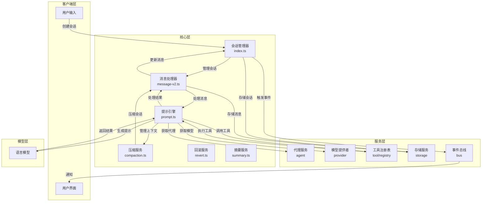
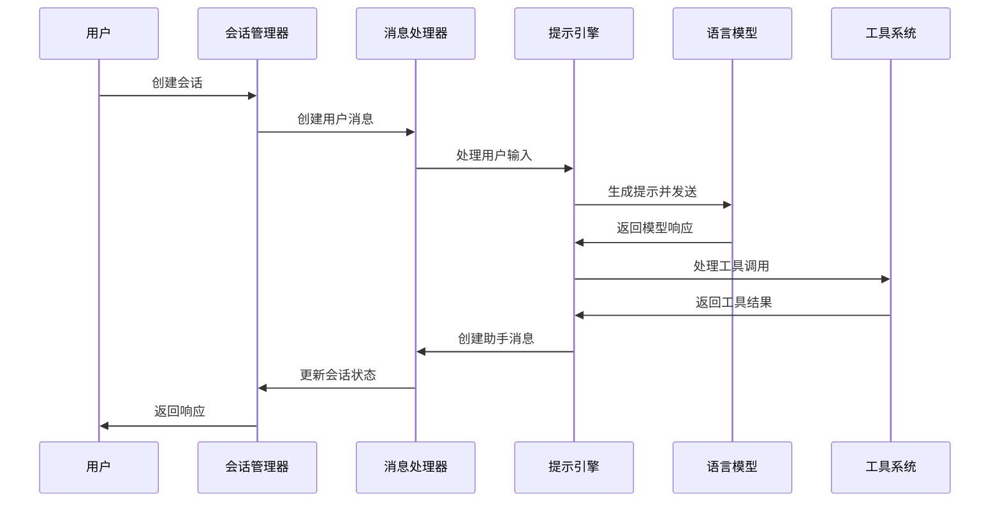
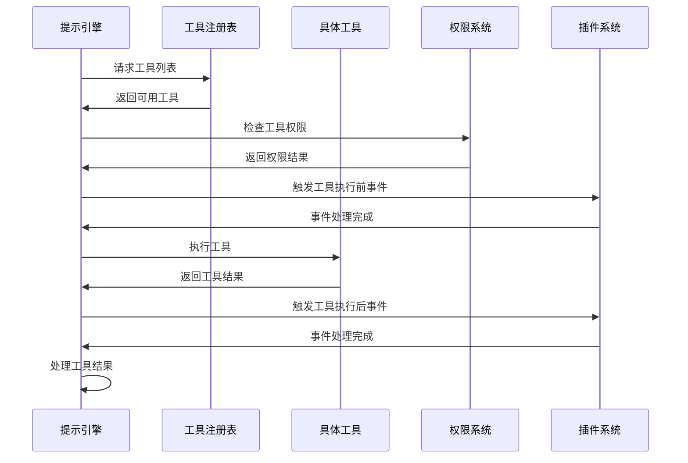
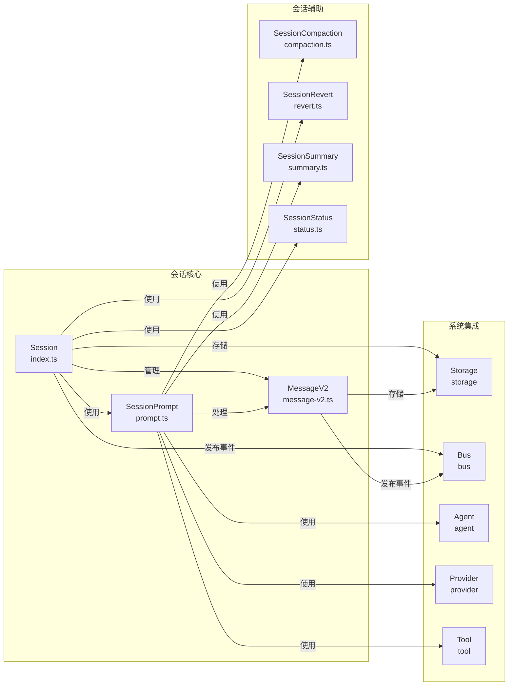

# OpenCode Session 模块文档

## 核心功能分析

Session 模块是 OpenCode 的核心组件之一，负责管理用户与 AI 助手之间的会话交互。通过分析代码，我发现该模块具有以下核心功能：

### 1. 会话管理

- **会话创建与配置**：支持创建新会话、子会话和分叉会话
- **会话状态管理**：跟踪会话的创建、更新、压缩和归档时间
- **会话共享**：支持将会话共享为可访问的 URL
- **会话权限**：通过权限系统控制会话的工具使用权限

### 2. 消息处理

- **消息类型**：支持用户消息和助手消息
- **消息部件**：支持多种类型的消息部件，如文本、文件、工具调用、推理等
- **消息流**：通过流式接口处理消息的读取和写入
- **消息转换**：将内部消息格式转换为模型可理解的格式

### 3. 提示处理

- **提示生成**：根据用户输入和上下文生成提示
- **系统提示**：管理系统级别的提示信息
- **指令提示**：管理指令级别的提示信息
- **提示循环**：处理提示的循环逻辑，包括工具调用、压缩等

### 4. 工具集成

- **工具注册**：管理可用的工具列表
- **工具调用**：处理工具的调用和执行
- **工具权限**：控制工具的使用权限
- **工具结果处理**：处理工具执行的结果

### 5. 会话压缩

- **上下文管理**：监控上下文长度，避免超出模型限制
- **自动压缩**：当上下文过长时自动触发压缩
- **手动压缩**：支持用户手动触发压缩
- **压缩策略**：通过摘要等方式压缩会话内容

## 架构设计

### 会话系统架构图

### 消息处理流程图

### 工具调用流程图

### 核心组件关系图

## 核心概念

### 1. 会话 (Session)

会话是用户与 AI 助手之间的交互会话，包含以下核心属性：

- **id**：会话的唯一标识符
- **slug**：会话的简短标识符
- **title**：会话的标题
- **parentID**：父会话的标识符（如果是子会话）
- **time**：会话的时间信息（创建、更新、压缩、归档）
- **permission**：会话的权限规则
- **share**：会话的共享信息

### 2. 消息 (Message)

消息是会话中的基本单位，分为用户消息和助手消息：

- **用户消息**：包含用户的输入、使用的代理、模型等信息
- **助手消息**：包含助手的响应、使用的工具、执行的步骤等信息

### 3. 消息部件 (Part)

消息部件是消息的组成部分，支持多种类型：

- **文本部件**：包含文本内容
- **文件部件**：包含文件内容
- **工具部件**：包含工具调用的信息
- **推理部件**：包含助手的推理过程
- **步骤开始部件**：标记步骤的开始
- **步骤结束部件**：标记步骤的结束
- **压缩部件**：包含压缩的信息
- **子任务部件**：包含子任务的信息
- **重试部件**：包含重试的信息

### 4. 提示 (Prompt)

提示是发送给语言模型的输入，包含以下信息：

- **系统提示**：提供系统级别的信息和指令
- **用户提示**：包含用户的输入和上下文
- **工具提示**：包含工具的信息和使用说明

### 5. 压缩 (Compaction)

压缩是处理会话上下文过长的机制，通过以下方式实现：

- **自动压缩**：当上下文超出阈值时自动触发
- **手动压缩**：用户可以手动触发压缩
- **摘要压缩**：通过生成摘要来压缩上下文

### 6. 工具 (Tool)

工具是助手可以使用的功能，包含以下类型：

- **内置工具**：系统内置的工具，如读取文件、列出目录等
- **自定义工具**：用户自定义的工具
- **MCP 工具**：通过 MCP (Model Context Protocol) 提供的工具

## 核心流程

### 1. 会话创建流程

1. 用户请求创建会话
2. 会话管理器生成会话 ID 和基本信息
3. 存储会话信息到存储服务
4. 发布会话创建事件
5. 如果配置了自动共享，生成共享 URL
6. 返回会话信息给用户

### 2. 消息处理流程

1. 用户发送消息到会话
2. 会话管理器创建用户消息
3. 提示引擎处理用户输入，生成提示
4. 提示引擎将提示发送给语言模型
5. 语言模型返回响应
6. 提示引擎处理响应，包括工具调用
7. 提示引擎创建助手消息
8. 会话管理器更新会话状态
9. 返回响应给用户

### 3. 工具调用流程

1. 提示引擎解析模型响应中的工具调用
2. 检查工具调用的权限
3. 触发工具执行前的插件事件
4. 执行工具并获取结果
5. 触发工具执行后的插件事件
6. 处理工具结果并更新消息

### 4. 压缩流程

1. 监控会话上下文的长度
2. 当上下文超出阈值时，触发压缩
3. 生成会话的摘要
4. 创建压缩部件并更新消息
5. 清理旧的会话内容

## 代码结构与功能

### 1. index.ts

核心会话管理文件，包含以下功能：

- **会话创建**：`create` 和 `createNext` 函数用于创建新会话
- **会话获取**：`get` 函数用于获取会话信息
- **会话更新**：`update` 函数用于更新会话信息
- **会话删除**：`remove` 函数用于删除会话
- **会话列表**：`list` 函数用于获取会话列表
- **会话子会话**：`children` 函数用于获取子会话
- **会话分叉**：`fork` 函数用于创建分叉会话
- **会话共享**：`share` 和 `unshare` 函数用于管理会话共享
- **消息管理**：`messages`、`updateMessage`、`removeMessage` 等函数用于管理消息
- **部件管理**：`updatePart`、`removePart` 函数用于管理消息部件
- **使用统计**：`getUsage` 函数用于计算会话的使用统计

### 2. message-v2.ts

核心消息处理文件，包含以下功能：

- **消息类型定义**：定义了用户消息和助手消息的结构
- **部件类型定义**：定义了各种类型的消息部件
- **消息转换**：`toModelMessages` 函数用于将内部消息格式转换为模型可理解的格式
- **消息流**：`stream` 函数用于流式处理消息
- **消息获取**：`get` 函数用于获取消息及其部件
- **部件获取**：`parts` 函数用于获取消息的部件
- **错误处理**：`fromError` 函数用于处理错误并转换为消息格式

### 3. prompt.ts

核心提示处理文件，包含以下功能：

- **提示生成**：`prompt` 函数用于生成提示
- **提示循环**：`loop` 函数用于处理提示的循环逻辑
- **工具解析**：`resolveTools` 函数用于解析可用的工具
- **用户消息创建**：`createUserMessage` 函数用于创建用户消息
- **提示部件解析**：`resolvePromptParts` 函数用于解析提示的部件
- **提醒插入**：`insertReminders` 函数用于插入提醒信息

### 4. compaction.ts

核心会话压缩文件，包含以下功能：

- **压缩处理**：`process` 函数用于处理会话的压缩
- **压缩创建**：`create` 函数用于创建压缩
- **溢出检查**：`isOverflow` 函数用于检查上下文是否溢出
- **压缩清理**：`prune` 函数用于清理旧的压缩

### 5. revert.ts

核心会话回滚文件，包含以下功能：

- **回滚处理**：`process` 函数用于处理会话的回滚
- **回滚创建**：`create` 函数用于创建回滚
- **回滚清理**：`cleanup` 函数用于清理回滚信息

### 6. summary.ts

核心会话摘要文件，包含以下功能：

- **摘要生成**：`summarize` 函数用于生成会话的摘要
- **摘要处理**：`process` 函数用于处理摘要的生成和更新

### 7. system.ts

核心系统提示文件，包含以下功能：

- **环境提示**：`environment` 函数用于生成环境相关的系统提示

### 8. instruction.ts

核心指令提示文件，包含以下功能：

- **系统指令**：`system` 函数用于生成系统级别的指令提示
- **指令清理**：`clear` 函数用于清理指令提示

### 9. processor.ts

核心会话处理器文件，包含以下功能：

- **处理器创建**：`create` 函数用于创建会话处理器
- **处理器执行**：`process` 函数用于执行会话处理逻辑
- **部件管理**：`partFromToolCall` 函数用于从工具调用创建部件

### 10. llm.ts

核心语言模型文件，包含以下功能：

- **模型调用**：`generate` 函数用于调用语言模型
- **模型配置**：管理语言模型的配置和参数

### 11. retry.ts

核心重试逻辑文件，包含以下功能：

- **重试处理**：`withRetry` 函数用于处理重试逻辑
- **重试策略**：定义重试的策略和参数

### 12. status.ts

核心状态管理文件，包含以下功能：

- **状态设置**：`set` 函数用于设置会话的状态
- **状态获取**：`get` 函数用于获取会话的状态

### 13. todo.ts

核心 TODO 管理文件，包含以下功能：

- **TODO 创建**：`create` 函数用于创建 TODO 项
- **TODO 更新**：`update` 函数用于更新 TODO 项
- **TODO 列表**：`list` 函数用于获取 TODO 列表

## 技术亮点

1. **模块化设计**：通过清晰的模块划分，实现了功能的解耦和复用
2. **类型安全**：使用 Zod 进行类型定义和验证，确保类型安全
3. **流式处理**：通过流式接口处理消息，提高了系统的响应速度和用户体验
4. **插件系统**：通过插件系统实现了功能的扩展和定制
5. **权限系统**：通过权限系统控制工具的使用，提高了系统的安全性
6. **压缩机制**：通过压缩机制处理长上下文，提高了系统的效率和可靠性
7. **事件驱动**：通过事件总线实现了组件之间的通信，提高了系统的可扩展性
8. **错误处理**：完善的错误处理机制，提高了系统的可靠性和用户体验

## 总结

Session 模块是 OpenCode 的核心组件之一，通过模块化的设计和丰富的功能，实现了用户与 AI 助手之间的高效交互。该模块支持多种类型的消息和工具，通过压缩机制处理长上下文，通过插件系统实现功能扩展，为用户提供了强大而灵活的会话管理能力。

通过本文档的分析，我们可以看到 OpenCode 的 Session 模块具有以下特点：

1. **功能丰富**：支持会话管理、消息处理、提示生成、工具调用等多种功能
2. **设计优雅**：采用模块化的设计，代码结构清晰，易于理解和维护
3. **性能高效**：通过流式处理、压缩机制等技术，提高了系统的性能和效率
4. **安全可靠**：通过权限系统、错误处理等机制，提高了系统的安全性和可靠性
5. **可扩展性强**：通过插件系统、事件驱动等技术，提高了系统的可扩展性

Session 模块的设计和实现为 OpenCode 提供了强大的会话管理能力，为用户提供了流畅、高效、安全的 AI 助手交互体验。
